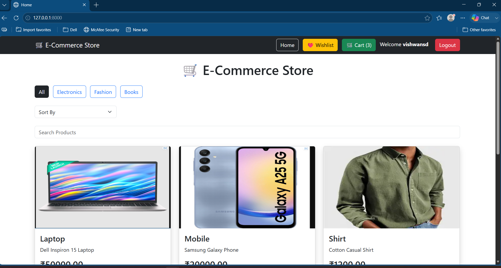
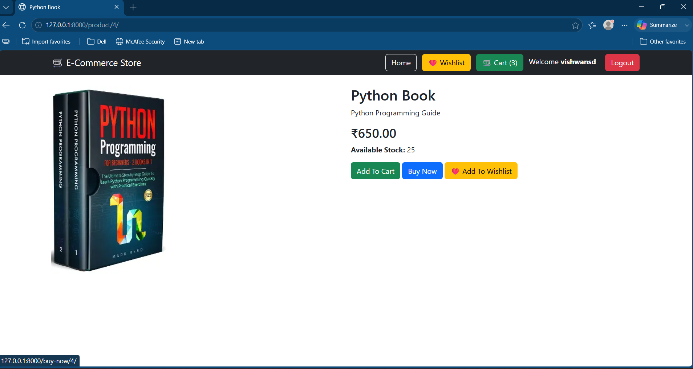
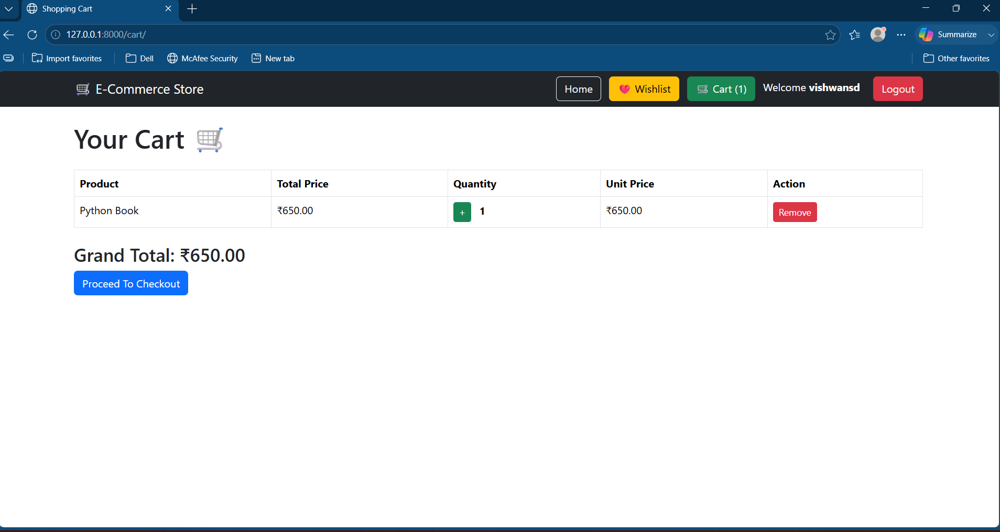
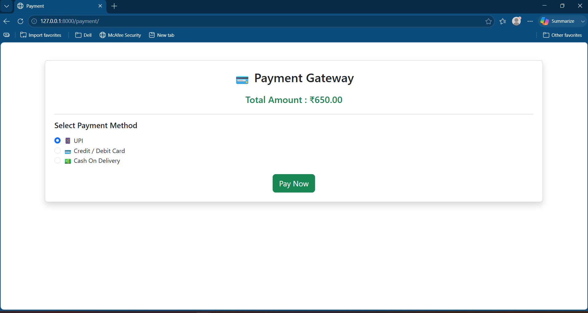
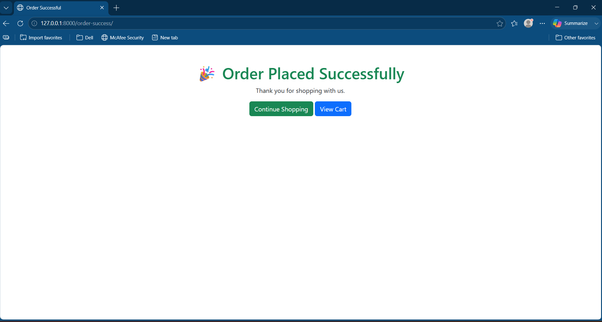
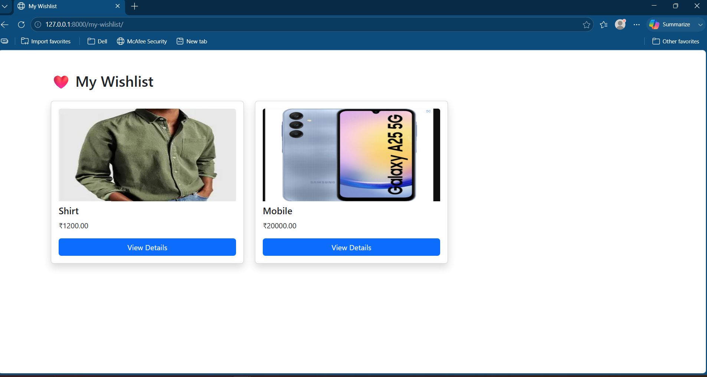

# 🛒 E-Commerce Platform

A web-based **E-Commerce Platform** developed using **Python, Django, HTML, CSS, Bootstrap, JavaScript, and MySQL**. The application enables users to browse products, search items, manage their shopping cart, place orders, and view order history through a user-friendly interface.

---

## ✨ Features

- 👤 User Registration and Login
- 🛍️ Product Catalog
- 🔍 Product Search
- 📂 Category-wise Product Filtering
- ↕️ Product Sorting (Price & Name)
- 🛒 Shopping Cart Management
- ❤️ Wishlist
- 💳 Buy Now & Payment Gateway
- 📦 Order Placement
- 📜 Order History
- 📱 Responsive User Interface

---

## 🛠️ Technologies Used

- Python
- Django
- HTML
- CSS
- Bootstrap
- JavaScript
- MySQL

---

## 📸 Screenshots

### Home Page

### Product Details

### Shopping Cart

### Payment Gateway

### Order Successful

### My Wishlist

---

## 🚀 Working Flow

1. Users register and log in securely.
2. Users browse products on the home page.
3. Users search, filter, and sort products.
4. Users view detailed information about products.
5. Products can be added to the shopping cart or wishlist.
6. Users proceed to the payment gateway to complete the purchase.
7. After successful payment, the order is placed successfully.
8. Users can view their previous orders through the order history page.

---

